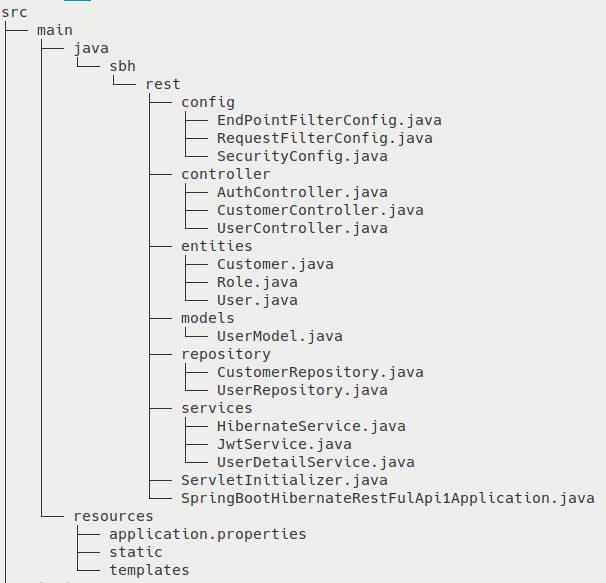

# Tạo ứng dụng spring boot api + hibernate

## Cách tạo project
### 1. Tạo bằng web site
* Truy cập website https://start.spring.io
* Xác nhận các tùy chọn cài đặt và tải xuống.

### 2. Tạo bằng extention spring tools của eclipse:
* Truy cập Marketplace của eclip.
* Tìm extention Spring Tools 4 và tải về.
* Sau khi tải hoàn tất chọn **File -> New -> Other -> Spring stated project -> next** và tùy chọn các cài đặt.

### 3. Tạo bằng công cụ spring tools stuie
* Truy cập trang web https://spring.io/tools tải công cụ về spring tools về và cài đặt.
* Cách tạo poject tương tự cách 2.

***Khuyến nghị chọn các cài đặt sau (Maven, jar, java 8)***

### Các thư viện cần thiết
* Mặc định khi chọn Maven project thì sẽ có sẵn 3 thư viện mặc định này.
```xml
<dependency>
  <groupId>org.springframework.boot</groupId>
  <artifactId>spring-boot-starter</artifactId>
</dependency>

<dependency>
  <groupId>org.springframework.boot</groupId>
  <artifactId>spring-boot-starter-test</artifactId>
  <scope>test</scope>
</dependency>
```
* Thêm các thư viện sau:
  * Thư viện để xây dựng ứng dụng web.
```xml
<dependency>
  <groupId>org.springframework.boot</groupId>
  <artifactId>spring-boot-starter-web</artifactId>
</dependency>
```
  * Cài thư viện spring-data-jpa (Cấu hình theo hướng dẫn này sẽ sử dụng hibernate được tích hợp sẵn trong đây, nếu không thích có thể tìm các thư viện hibernate khác thay thế vào).
```xml
<dependency>
    <groupId>org.springframework.boot</groupId>
    <artifactId>spring-boot-starter-data-jpa</artifactId>
</dependency>
```
  * Thư viện kết nối tới cơ sở dữ liệu (Trong hướng dẫn này sử dụng mysql, các loại database tìm và thay thế tương tự).
```xml
<dependency>
    <groupId>mysql</groupId>
    <artifactId>mysql-connector-java</artifactId>
    <scope>runtime</scope>
</dependency>
```
  * Thư viện xứ lý token.
```xml
<dependency>
  <groupId>io.jsonwebtoken</groupId>
  <artifactId>jjwt</artifactId>
  <version>0.9.1</version>
</dependency>
```
  * Thư viện spring securiy (lá chắn siêu cao cấp :v).
```xml
<dependency>
  <groupId>org.springframework.boot</groupId>
  <artifactId>spring-boot-starter-security</artifactId>
</dependency>
```
## Cấu trúc thư mục

#### config:
* Chứa các cấu hình Spring security
  * *EndPointFilterConfig*: Cấu hình response trả về khi chưa đăng nhập.
  * *RequestFilterConfig*:  Cấu hình filter request trước khi dữ liệu đi vào controller.
  * *SecurityConfig*: Cấu hình phân quyền cho từng api.
#### controller: Điều hướng các request
#### entities:
* Các object mapping database
#### models: 
* Các object mapping data từ request
#### repository: 
* Các object xử lý database
#### services: 
* **HibernateService**: Cấu hình kết nối database
* **JwtService**: Cấu hình xử lý chuỗi jwt
* **UserDetailService**: Xử lý lưu thông tin user login vào contextHolder

#### src/main/resources/application.properties
* Khai báo các chuỗi kết nối, cấu hình cài đặt cho ứng dụng và các cấu hình sẽ đọc bằng anotation *@Value*

#### Chi tiết mời tham khảo code. Tác giả không  viết doc giải thích từng đoạn code nổi :))
* *Ờ thì cơ bản là lười :v*